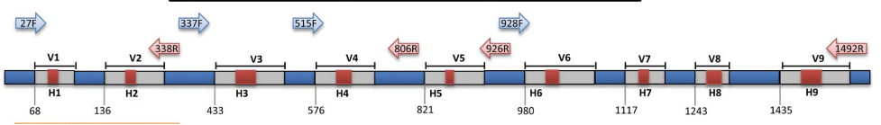

# Welcome to the Bioinformatics Analysis of Microbiome Data

## 1. INTRODUCTION
We will be working with NGS data generated from 3 groups of mice: IL-10-/- (deficient), MUC2-/- (deficient), and wild-type mice.

### 1.1 Data type:
16S rRNA gene sequences from the V4-V5 region, which was targeted with F515/R926 primers (with modifications). The library was sequenced on the Illumina Miseq platform, yielding paired-end reads of 250 bp length (each).

{ align=left }

**Figure from Shahi et al. 2017. Gut microbiome in multiple sclerosis: The players involved and the roles they play. Gut Microbes.**

**Figure 1.** Illustration of conserved, variable, hypervariable regions within the 16S rRNA gene and the various primer pairs used for metagenomic sequencing. Conserved regions are represented in blue, variable regions in gray, and hypervariable regions in red. 

<!-- 
We ask all students to bring their own laptop (there will be only limited number of laptops for those who cannot bring one). Before the beginning of the practical course make sure you have the following software installed. Follow the instructions provided below depending on the operating system (OS) you are using. We will provide a troubleshooting session on Tuesday, after the lecture, for those who need to resolve installation issues.

## For Windows Users:

* `mkdocs new [dir-name]` - Create a new project.
* `mkdocs serve` - Start the live-reloading docs server.
* `mkdocs build` - Build the documentation site.
* `mkdocs -h` - Print help message and exit.

## For Mac Users:

## For Linux Users:

    mkdocs.yml    # The configuration file.
    docs/
        index.md  # The documentation homepage.
        ...       # Other markdown pages, images and other files.

_This document serves as a quick-start guide and reference card for installing and using pong. Please refer to the [software manual](https://github.com/ramachandran-lab/pong/blob/master/pong-manual.pdf) for comprehensive information._

## Installing pong

pong has been tested on macOS (10.8-11), Linux (Ubuntu 15.04, Linux Mint 17.2), and Windows 7.

pong is hosted on [PyPI](https://pypi.python.org/pypi) and can thus be easily installed with `pip`. In order to run pong, you need Python 3 (version 3.6 or newer) and a modern web browser.

To install pong, run:

```bash
# If you have Miniconda (or Anaconda)
pip3 install pong   [ brew upgrade python ]
```

__Note to Python 2 users:__ Older versions of pong run on Python 2.7. The latest version of pong compatible with Python 2 can be installed with `pip install pong==1.4.9`


<span style="font-size:85%">*__Tip:__ Click on the question mark at the top of the screen for a quick tutorial on how to interact with pong's web app (including highlighting multimodality and downloading plots).*</span>


# Running pong on your own data

pong's setup is designed to be low-hassle. This section details the required and optional input files that pong handles. 

### Clustering output

pong accepts clustering output files, or _Q_ matrices, from a variety of clustering inference programs. The command line option `-c`, or `--ignore_cols`, tells pong how many leading columns of each row of the input _Q_ matrix files to skip before parsing individual membership coefficients. For example, use `-c 5` for some versions of <span style="font-variant: small-caps">Structure</span>
indiv output to ignore covariate metadata. In the case that no leading columns should be skipped (e.g. for ADMIXTURE output), it is not necessary to provide `-c 0` because the default value of `-c` is 0. 


### _filemap_ file

A bit of information about the input _Q_ matrices must be provided, in the form of a _filemap_. A _filemap_ is a three-column, tab-delimited file. Each line contains the following information about a single _Q_ matrix:

1. A unique ID (e.g. `iter5_K=7`; this must contain at least one letter, and cannot contain a hashmark/hashtag or a period. Integers, spaces, and other special characters are accepted.)
2. The _K_ value
3. The _Q_ matrix file path, relative to the _filemap_. Thus, if the _filemap_ is in the same directory as the _Q_ matrix files, this is just the name of the _Q_ matrix file.


# Additional resources

The example dataset, software manual, and other relevant materials can be found at the [Ramachandran Lab website](http://brown.edu/Research/Ramachandran_Lab/projects). 

Contact [Aaron Behr](mailto:aaron_behr@alumni.brown.edu?subject=pong) or [Sohini Ramachandran](mailto:sramachandran@brown.edu?subject=pong) for more information. --> 


<!-- ##### Using custom colors to generate perm files for Distruct -->
<!-- pong is intended to replace... -->

<!-- # Interactive visualization -->
<!-- pong's custom, D3-based visualization tool is meant to be easy to use.  -->
