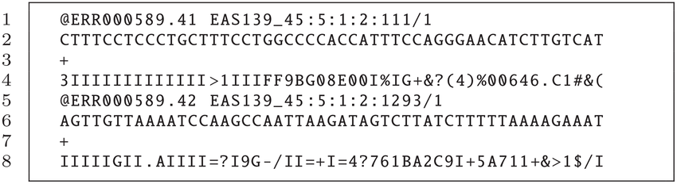

# Workflow

## PRELIMINARY READ PROCESSING

In our pipeline we will be working with reads that have already been demultiplexed and trimmed (primers and barcodes removed). You will need to download the following starting folder for your analyses: fastq_after_cutadapt. For each sample, there are two fastq files (R1 and R2). R1 corresponds to all the forward reads and R2 to all the reverse reads.

We will first look at the fastq files, then check the quality of the reads with FastQC and MultiQC, and then conduct read processing in QIIME2 (denoising and OTU clustering). Follow the steps below:

### 1.	Check the [fastq files](https://knowledge.illumina.com/software/general/software-general-reference_material-list/000002211#)
After sequencing, the output is provided in the form of two FASTQ files per sample, one labelled R1 (forward reads) and one labelled R2 (reverse reads). Each FASTQ file contains reads, and these are provided as an entry with 4 lines: 

1.	The first line contains a sequence identifier, including information about the sequencing run and the cluster. It usually begins with an “@”.
2.	The second line contains the base calls of the sequence (A, C, T, G and N).
3.	The third line comprises a plus (+) sign, which acts as a separator.
4.	The fourth line, which is important for the next step, provides information on the quality of each of the base calls. These are Phred +33 encoded, using ASCII characters to represent the numerical quality scores.

An example of one entry of a FASTQ file (note that this corresponds to only one read of hundreds or thousands sequenced):
{ align=left }

???+ danger "Exercise 1"
    Select two fastq files, one corresponding to forward reads (R1) and one corresponding to reverse reads (R2). Next, explore the files using the command line (**tip:** use the commands you learnt previously).

???+ question "Question(s):"
    1.	Print the first 10 lines
    2.	Is the file format as expected?
    3.	How many reads (entries) are there in each of these two files?

### 2.	 Quality check using FastQC 
We now examine the quality of the bases. This will help us determine if there are parts of the reads that need to be trimmed/truncated. 

For the two fastq files you selected earlier, run fastqc as follows:
Access the folder with all the raw .fastq (navigate with the `cd` command) files through Terminal (Mac Users) or Powershell (Windows Users). Next run the following command: 

=== "Mac"

    ``` bash
    docker run --rm -v $(pwd):/data/ -w /data/ -it pegi3s/fastqc *.fastq
    ```

=== "Windows"

    ``` bash
    docker run --rm -v ${PWD}:/data/ -w /data/ -it pegi3s/fastqc *.fastq
    ```

???+ question "Question(s):"
    1.	Overall, which fastq file has higher quality scores, the R1 or R2?
    2.	In each of these files, at which position do you observe a steep decline in base quality?


### 3.	QIIME2

We will now use QIIME2 for the next steps in the workflow: these involve importing the fastq files, trimming the primers, "cleaning up" the reads the merging the forward and reverse reads, generating a table containing information on the reads and their abundance, assigning taxonomy to these reads, and carrying out statistical analyses on bacterial diversity. 

#### 3.1 Activate QIIME 2 environment
As a first step, activate QIIME with the following command:

=== "Mac"

    ``` bash
    conda activate qiime2-2023.5
    ```

=== "Windows"

    ``` bash
    docker run --rm -v $(pwd):/data/ -w /data/ -it quay.io/qiime2/core:2023.5
    ```

#### 3.2. Import raw data
Next, you will import the raw data (fastq files) by running qiime tools import. Notice that with this tool, each of the parameters you can provide starts with two dashes. Here you will be specifying the following parameters:

* --type: whether your data is single-end or paired-end
* --input-path specifies where your raw data is (path to the folder)
* --input-format specifies the format of the data. The available choices are provided [here](https://docs.qiime2.org/2023.7/tutorials/importing/#sequence-data-with-sequence-quality-information-i-e-fastq)
* --output-path: species the output path of the artefact you generate.

Run the following command:

``` bash
qiime tools import \
    --type 'SampleData[PairedEndSequencesWithQuality]' \
    --input-path Raw_data/Raw_data_zipped \
    --input-format CasavaOneEightSingleLanePerSampleDirFmt \
    --output-path Output/demux-paired-end.qza
```
 
#### 3.3 Summarise imported data and visualise
You can now check whether the data was imported by running qiime demux summarise, specifying the name of the input file and the name of the artefact you want to generate. You can visualise this artefact by dropping it in QIIME2 view (https://view.qiime2.org/). 

``` bash
qiime demux summarize \
    --i-data Output/demux-paired-end.qza \
    --o-visualization Output/demux-paired-end-summary.qzv  
```

???+ question "Question(s):"
    === "Basic - Check the “Overview” tab"
        1.	How many forward and reverse reads are there overall?
        2.	For the samples you examined on FastQC, how many forward reads and reverse reads are there?
        3.	Do any samples stand out eg have a particularly high or low number of reads? 
    === "Advanced – check the “Interactive” tab"
        1.	Look at the plots and the quality scores: What trends do you observe in terms of quality score changes in the forward and reverse reads?
        2.	Scroll down to the “Demultiplexed sequence length summary”: What is the read length? How much overlap do you expect for the forward and reverse reads? 

#### 3.4 Remove primers with Cutadapt
We need to remove the primers that were used for targeted amplification. To do this we use cutadapt trim-paired, specifying these main parameters:

* --i-demultiplexed-sequences: specify input file name
* --p-front-f GTGYCAGCMGCCGCGGTAA: specify sequence of the forward primer
* --p-front-r CCGYCAATTYMTTTRAGTTT: specify sequence of the reverse primer 
* --p-match-adapter-wildcards: ?
* --p-match-read-wildcards: ?
* --p-discard-untrimmed: ?
* --o-trimmed-sequences: specify output file 

???+ tip "tip:" 
    --verbose: The verbose option specifies that you want to display detailed processing information on your screen. 

```bash
qiime cutadapt trim-paired \
    --i-demultiplexed-sequences Output/demux-paired-end.qza \
    --p-front-f GTGYCAGCMGCCGCGGTAA \
    --p-front-r CCGYCAATTYMTTTRAGTTT \
    --p-match-adapter-wildcards \
    --p-match-read-wildcards \
    --p-discard-untrimmed \
    --verbose \
    --o-trimmed-sequences Output/paired-end-demux-trimmed.qza | tee Output/cutadaptresults.log
```

???+ question "Question(s):"
    1.	What does  --p-match-read-wildcards do? Tip: go to the Cutadapt website to find out (https://cutadapt.readthedocs.io/en/stable/)
    2.	What does --p-discard-untrimmed do? What kinds of reads might not get trimmed? 
    3.	For the same samples explored earlier, open the fastq files after having run cutadapt. 

#### 3.5 Denoise with DADA2

Now we will “denoise” the reads, that is, carry out a series of steps with the goal of retaining “true” reads, those that represent the taxa that are present in the sample. These reads may differ by one nucleotide, and they are referred to as exact sequence variants (ESVs) or amplicon sequence variants (ASVs). 

As we are working with paired end reads, we use qiime2 dada2 denoise-paired. Through this command, quality filtering, merging of forward and reverse reads, dereplication and removal of chimeras is conducted. 

The quality filtering aspect refers to trimming the ends of reads where quality is suboptimal, users can also discard sequences below a particular length. This step is done first to optimize the merging of forward and reverse reads. The merging is done according to default parameters (not specified in the command). 

Dereplication combines all identical sequencing reads into “unique sequences” with a corresponding “abundance” equal to the number of reads with that unique sequence. Dereplication substantially reduces computation time by eliminating redundant comparisons.

Removal of chimeras refers to the removal of sequences that align to different positions in a reference genome?

The main parameters specified are the following: 

* --i-demultiplexed-seqs: specify input file name
* --p-trunc-len-f : specify at what length the forward reads will be cut 
* --p-trunc-len-r: specify at what length the reverse reads will be cut 
* --o-table: specify output file name 
* --o-representative-sequences: specify output file name for the dereplicated sequences
* --o-denoising-stats: specify output file name for the denoising statistics

You can find more information on DADA2 here (https://benjjneb.github.io/dada2/).

Run the following command: 
 
```bash
qiime dada2 denoise-paired \
    --i-demultiplexed-seqs Output/paired-end-demux-trimmed.qza \
    --p-trunc-len-f 225 \
    --p-trunc-len-r 225 \
    --o-table Output/table.qza \
    --o-representative-sequences Output/rep-seqs.qza \
    --o-denoising-stats Output/denoising-stats.qza 
```

#### 3.6. Summarize read counts

We now summarise the number of reads in each sample after denoising, using qiime feature-table summarize. Then 

The main parameters specified are the following: 

* --i-table: specify input file 
* --o-visualization: specify output file for visualization in QIIME2 view
* --m-sample-metadata-file: specify which is the metadata file

Run the following command: 
```bash
qiime feature-table summarize \
    --i-table Output/table.qza \
    --o-visualization Output/table.qzv \
    --m-sample-metadata-file Output/metadata.tsv
```

Open QIIME2 view (https://view.qiime2.org/) and drop the table.qzv to see the results. 

???+ question "Question(s):"
    1.	Across all 18 samples, compare the number of reads before and after denoising. 
    2.	Get together in pairs, and on a piece of paper, calculate the percentage of reads that have been retained for each sample. 

**Optional command:** Visualise the representative sequences after denoising with DADA2
We use qiime feature-table tabulate-seqs with the following parameters: 

*  --i-data: specify input file
*  --o-visualization: specify output file for visualization in QIIME2 view

Run the following command: 

```bash
qiime feature-table tabulate-seqs \
    --i-data Output/rep-seqs.qza \
    --o-visualization Output/rep-seqs.qzv
```

???+ question "Question(s):"
    1. After running denoising with DADA2, we have obtained a set of amplicon sequence variants or exact sequence variants. Why is the length of these sequences different to that of the reads in the first fastq files you looked at?  


#### 3.7  Assign taxonomy
We now assign taxonomy to the representative sequences found across all samples. We do so using a QIIME2 x and a database in the form of a QIIME2 artefact. Taxonomic assignment is done using taxonomic ranks (explain), explain confidence 

WE do so by using the qiime feature-classifier classify-sklearn and the following parameters: 

* --i-classifier silva-138-ssu-nr99-97-V4V5-classifier.qza \
* --i-reads rep-seqs.qza \
* --o-classification taxonomy.qza

```bash 
qiime feature-classifier classify-sklearn \
    --i-classifier silva-138-ssu-nr99-97-V4V5-classifier.qza \
    --i-reads rep-seqs.qza \
    --o-classification taxonomy.qza
```

##### tabulate taxonomy
```bash
qiime metadata tabulate \
    --m-input-file taxonomy.qza \
    --o-visualization taxonomy.qzv
```


???+ question "Question(s)"
    1. Are there any sequences that are not bacterial? If so, what are they?

#### 3.8 Filter out seqeunces which are not bacterial

!!! tip "16S rRNA"
    By targeting 16S rRNA, we want to target bacteria and archaea. Therefore, we can exclude sequences that are unexpected such as those from chloroplasts or mitochondria. By setting --p-include p__, we are retaining only sequences annotated at a minimum to the phylum level. Note: this will look different depending on the database used. Greengenes specifically uses the following format for annotations: k__;p__;c__;o__;f__;g__;s__. Also, --p-mode contains ensures that search terms are case insensitve (e.g., mitochondria versus Mitochondria).

```bash
qiime taxa filter-table \
--i-table table.qza \
--i-taxonomy taxonomy.qza \
--p-mode contains \
--p-include p__ \
--p-exclude 'p__;,Chloroplast,Mitochondria' \
--o-filtered-table filtered-table.qza
```
 
```bash
qiime feature-table filter-seqs \
--i-data rep-seqs.qza \
--i-table filtered-table.qza \
--o-filtered-data filtered-sequences.qza
```

#### 3.9 Generate taxonomic barplots

```bash
qiime taxa barplot \
--i-table filtered-table.qza \
--i-taxonomy taxonomy.qza \
--m-metadata-file metadata.tsv \
--o-visualization taxa-bar-plots-1.qzv
```

#### 3.10. Generate the rarefaction curve

???+ quote "Rarefaction curve"
    A rarefaction curve plots the number of counts sampled (rarefaction depth) vs. the expected value of species diversity. --- Weiss et al. 2017

!!! info "Rarefaction curve" 
    Rarefaction curve: As the sequencing depth increases, you recover more and more of the diversity observed in the data. At a certain point (read depth), diversity will stabilize, meaning the diversity in the data has been fully captured. This point of stabilization will result in the diversity measure of interest plateauing.

???+ tip "tip"
    Help on aplha diversity: qiime diversity alpha-rarefaction –help


```bash
qiime diversity alpha-rarefaction \
    --i-table filtered-table.qza \
    --i-phylogeny phylogeny-align-to-tree-mafft-fasttree/rooted_tree.qza \
    --m-metadata-file metadata.tsv \
    --p-max-depth 80000 \
    --o-visualization alpha-rarefaction-plot_80000.qzv
```

???+ question "Question(s):"
    1.	Why did we specify a max depth of 88,644?
    2.	Do you observe differences across the three groups?

#### 3.11. Core metrics phylogenetic: alpha and beta diversities¶
We will now produce a number of core diversity metrics (alpha and beta) using a QIIME 2 pipeline, qiime diversity core-metrics-phylogenetic.

???+ note "info"
    The parameters we need to know include the path to our rooted tree (--i-phylogeny), the path to our feature table (--i-table), the sampling depth at which we would like to rarefy (--p-sampling-depth), the path to the sample information (--m-metadata-file), and the name of the directory we would like to save our results to (--output-dir). If you do not have a tree, or you are not interested in phylogenetic diversity metrics, you can also use qiime diversity core-metrics. We can speed up this command by including the --p-n-jobs-or-threads parameter.

???+ question "Question(s):"
    We have chosen a sampling depth that corresponds to the minimum number of reads in a sample. Which sample is it?


<!--
  1. Material for MkDocs uses [semantic versioning][^2], which is why it's a
    good idea to limit upgrades to the current major version.

    This will make sure that you don't accidentally [upgrade to the next
    major version], which may include breaking changes that silently corrupt
    your site. Additionally, you can use `pip freeze` to create a lockfile,
    so builds are reproducible at all times:

    ```
    pip freeze > requirements.txt
    ```

    Now, the lockfile can be used for installation:

    ```
    pip install -r requirements.txt
    ```

> **_NOTE:_** The note content.

??? question "How to add plugins to the Docker image?"

  Material for MkDocs only bundles selected plugins in order to keep the size
  of the official image small. If the plugin you want to use is not included,
  you can add them easily:

  === "Material for MkDocs" 

    Create a `Dockerfile` and extend the official image:

    ``` Dockerfile title="Dockerfile"
    FROM squidfunk/mkdocs-material
    RUN pip install mkdocs-macros-plugin
    RUN pip install mkdocs-glightbox
    ```

  === "Insiders"

    Clone or fork the Insiders repository, and create a file called
    `user-requirements.txt` in the root of the repository. Then, add the
    plugins that should be installed to the file, e.g.:

    ``` txt title="user-requirements.txt"
    mkdocs-macros-plugin
    mkdocs-glightbox
    ```

  Next, build the image with the following command:

  ```
  docker build -t squidfunk/mkdocs-material .
  ```

  The new image will have additional packages installed and can be used
  exactly like the official image.

-->


 
 
```bash
#!unzip alpha-rarefaction-plot_50000.qzv

#!unzip alpha-rarefaction-plot_60000.qzv

unzip alpha-rarefaction-plot_80000.qzv
```
 
!!! warning "Update the path to the "new" extracted directory"
     Update the path to the "new" extracted directory: !open new_directory/data/index.html

open 2dcca9b2-070d-43a1-af5d-99fc3b55799b/data/index.html


### 8. Core metrics phylogenetic: alpha and beta diversities

!!! info "info" 
    We will produce a number of core diversity metrics (alpha and beta) using a QIIME 2 pipeline, qiime diversity core-metrics-phylogenetic.

???+ note "info"
    The parameters we need to know include the path to our rooted tree (--i-phylogeny), the path to our feature table (--i-table), the sampling depth at which we would like to rarefy (--p-sampling-depth), the path to the sample information (--m-metadata-file), and the name of the directory we would like to save our results to (--output-dir). If you do not have a tree, or you are not interested in phylogenetic diversity metrics, you can also use qiime diversity core-metrics. We can speed up this command by including the --p-n-jobs-or-threads parameter.

???+ info "info?"
    - The rarefaction curve shows the sampling depth and the number of samples.
    - Meghna chose 40000 sampling depth here so that we can still look at all the 18 samples.
    - Meghna tried 50000 sampling depth and the total number of samples was reduced to 9 in future plots.
    - Tamara and Meghna tried 20000 sampling depth due to alpha-rarefaction-plot_80000.qzv --> first sample drops out at around 22000 sequencing depth

```bash
qiime diversity core-metrics-phylogenetic \
--i-phylogeny phylogeny-align-to-tree-mafft-fasttree/rooted_tree.qza \
--i-table filtered-table.qza \
--p-sampling-depth 20000 \
--p-n-jobs-or-threads 4 \
--m-metadata-file metadata.tsv \
--output-dir diversity-core-metrics-phylogenetic
```
 
```bash
ls -l diversity-core-metrics-phylogenetic
```
 

#### 8.1 Alpha diversity
```bash
qiime diversity alpha-group-significance \
--i-alpha-diversity diversity-core-metrics-phylogenetic/observed_features_vector.qza \
--m-metadata-file metadata.tsv \
--o-visualization alpha-group-sig-obs-feats.qzv
```
 
```bash
unzip alpha-group-sig-obs-feats.qzv
```
 
```bash
open 51553b22-2b97-4265-90cb-f211b22016c1/data/index.html
```
 

#### 8.2 Beta rarefaction

???+ note "Note"
    Again, rarefaction is used to eliminate issues due to differences in library size prior to beta diversity. This method is built-in to QIIME 2 core metrics pipelines. We can examine the stability of a beta diversity metric using qiime diversity beta-rarefaction.

 
```bash
qiime diversity beta-rarefaction \
--i-table filtered-table.qza \
--p-metric braycurtis \
--p-clustering-method nj \
--p-sampling-depth 20000 \
--m-metadata-file metadata.tsv \
--o-visualization braycurtis-rarefaction-plot.qzv
```
 
```bash
unzip braycurtis-rarefaction-plot.qzv
```

```bash
open c9a5f4f9-22af-4a41-9dba-abb20ad140e1/data/index.html
```
 

#### 8.3 PCoA plots for beta diversity

???+ info "info?"
    PCoA was included by default in our core-metrics-phylogenetic pipeline. Because these are longitudinal data, we will customize the axis to include the varaible, week-relative-to-hct.

 
```bash
unzip uu-pcoa-emperor-w-time.qzv
```

```bash
open e864fa09-a2a2-45ef-9c7c-cdb4ffc077b2/data/index.html
```
 
```bash
qiime emperor plot \
--i-pcoa diversity-core-metrics-phylogenetic/weighted_unifrac_pcoa_results.qza \
--m-metadata-file metadata.tsv diversity-core-metrics-phylogenetic/faith_pd_vector.qza diversity-core-metrics-phylogenetic/evenness_vector.qza diversity-core-metrics-phylogenetic/shannon_vector.qza \
--o-visualization wu-pcoa-emperor-w-time.qzv
```
 
```bash
unzip wu-pcoa-emperor-w-time.qzv
```

```bash
open 8312bd2c-1554-45a3-a3ba-1d3878e9b564/data/index.html
```
